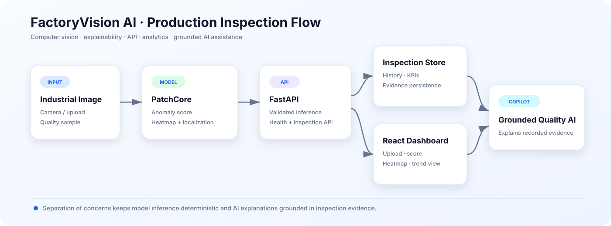

<div align="center">

# FactoryVision AI

### AI-powered industrial visual inspection & quality intelligence

**PatchCore anomaly detection · defect localization · FastAPI · React · inspection analytics · grounded copilot context**


</div>

FactoryVision AI is an end-to-end industrial quality-inspection platform for **detecting, localizing, tracking and explaining manufacturing anomalies**. The system connects a validated PatchCore model to a real API, persistent inspection history, a React dashboard and grounded quality-assistance context.

## Architecture



The production path keeps responsibilities explicit: image ingestion → deterministic anomaly inference → API boundary → persistent quality evidence → dashboard/coplay context.

## Highlights

| Area | What the project demonstrates |
|---|---|
| Computer vision | PatchCore anomaly scoring and localization |
| Explainability | Heatmaps / defect-localization overlays |
| Backend | FastAPI health, inference, history and copilot-context endpoints |
| Analytics | Inspection history, defect rate and quality KPIs |
| Frontend | React quality-engineering dashboard |
| MLOps | Hosted training, reproducible evaluation and portable model release metadata |
| Deployment | Single-container boundary with external model/database assets |

## PatchCore baseline

Evaluated on five MVTec AD categories:

| Category | Image AUROC | Image F1 | Pixel AUROC | Pixel F1 |
|---|---:|---:|---:|---:|
| bottle | 1.0000 | 0.9920 | 0.9856 | 0.7263 |
| cable | 0.9829 | 0.9674 | 0.9847 | 0.6393 |
| metal_nut | 0.9971 | 0.9838 | 0.9867 | 0.8384 |
| transistor | 0.9958 | 0.9500 | 0.9740 | 0.6131 |
| zipper | 0.9753 | 0.9791 | 0.9814 | 0.5422 |

**Mean image AUROC: 0.9902 · Mean image F1: 0.9745 · Mean pixel AUROC: 0.9825**

Machine-readable results live in `ml/results/patchcore_mvtec_baseline.csv`.

## Verified model release

The selected `bottle` PatchCore checkpoint was restored and exercised through the FastAPI inference endpoint.

- Release: `bottle-patchcore-v1`
- Verified anomalous example score: `0.64147`
- Runtime readiness: `/health` → `model_ready: true`
- Release metadata: `ml/releases/bottle_patchcore_v1.json`

Large checkpoints and release archives stay outside Git.

## API surface

```text
GET  /health
POST /api/v1/inspect
GET  /api/v1/inspections
GET  /api/v1/copilot/context
```

The inference response can include anomaly score, decision metadata and a base64 PNG localization overlay.

## Frontend experience

The React workspace provides:

- image upload;
- runtime/model readiness;
- anomaly score and localization;
- inspection count and defect rate;
- recent inspection history;
- evidence for a grounded quality copilot.

## Repository layout

```text
backend/        FastAPI service + SQLite-backed inspection persistence
ml/             training code, experiments, evaluation and release metadata
frontend/       React/Vite quality dashboard
scripts/        validation, smoke tests and release utilities
data/           dataset documentation only
docs/           architecture, training and deployment documentation
tests/          backend and release-integrity tests
.github/        CI workflows
```

## Development strategy

Training is designed for free hosted notebooks (Kaggle first, Colab fallback). The initial dataset is **MVTec AD**. Raw datasets and trained checkpoints are intentionally excluded from the repository.

## Deployment boundary

A multi-stage Docker build can package the React frontend with the FastAPI runtime while keeping the model checkpoint and SQLite database external/persistent. This keeps a clean path for a future cloud deployment without claiming resources that are not provisioned.

## Status

**v0.7 — grounded copilot and deployment foundation.**

Implemented: hosted training, five-category evaluation, explainability review, portable release metadata, real inference, persistence, KPIs, connected frontend and grounded copilot context.

## Responsible use

Do not commit MVTec AD images, release ZIPs or trained checkpoints. Respect dataset licensing and validate any industrial deployment on domain-specific production data.

## Author

Developed and maintained by **Chaima Menouar**.
