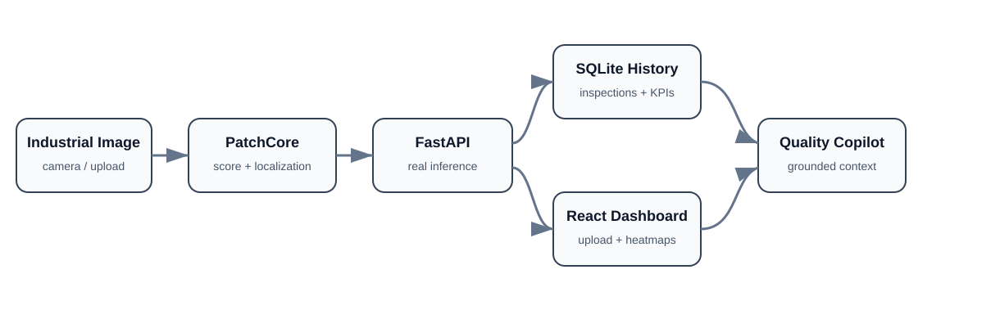

# FactoryVision AI

**AI-powered quality inspection and manufacturing copilot.** FactoryVision AI is an end-to-end industrial visual-inspection platform for detecting, localizing, tracking, and explaining manufacturing defects.

## Architecture



The production path is deliberately layered: an industrial image is scored and localized by PatchCore, FastAPI exposes real inference, inspection history is persisted for analytics, React visualizes quality evidence, and a grounded copilot context is built only from recorded inspections.

## Project goals

- detect anomalous or defective products from images;
- localize defects with anomaly heatmaps/masks;
- expose model inference through FastAPI;
- persist inspections and quality metrics;
- provide a React quality-engineering dashboard;
- prepare a grounded AI quality copilot;
- keep Azure provisioning separate until the cloud phase is intentionally started.

## Development strategy

Model training is designed for free hosted notebooks rather than local training. Kaggle is the primary path, with Colab as a fallback. Raw industrial datasets and trained checkpoints are intentionally excluded from GitHub.

Initial dataset: **MVTec AD**.

## PatchCore baseline

The first reproducible baseline covers `bottle`, `cable`, `metal_nut`, `transistor`, and `zipper`.

| Category | Image AUROC | Image F1 | Pixel AUROC | Pixel F1 |
|---|---:|---:|---:|---:|
| bottle | 1.0000 | 0.9920 | 0.9856 | 0.7263 |
| cable | 0.9829 | 0.9674 | 0.9847 | 0.6393 |
| metal_nut | 0.9971 | 0.9838 | 0.9867 | 0.8384 |
| transistor | 0.9958 | 0.9500 | 0.9740 | 0.6131 |
| zipper | 0.9753 | 0.9791 | 0.9814 | 0.5422 |

Mean metrics across the five categories:

- Image AUROC: **0.9902**
- Image F1: **0.9745**
- Pixel AUROC: **0.9825**
- Pixel F1: **0.6719**

The machine-readable summary is stored in `ml/results/patchcore_mvtec_baseline.csv`.

## Verified model release

The selected `bottle` PatchCore checkpoint was independently restored and exercised through the FastAPI endpoint. The API returned a real anomalous prediction for `broken_small/000.png` with an anomaly score of `0.64147`, while `/health` reported `model_ready: true`.

Release metadata:

- release: `bottle-patchcore-v1`
- archive: `factoryvision-bottle-patchcore-release.zip`
- checkpoint SHA-256: `8c1e120c2554d055cf3c9d2779da2dbbd1fd8f022c632c9feab1366528d705db`
- registry metadata: `ml/releases/bottle_patchcore_v1.json`

Large checkpoints and release archives remain external artifacts and are ignored by Git.

## Backend capabilities

- `GET /health` — runtime/model readiness;
- `POST /api/v1/inspect` — real PatchCore image inference;
- `GET /api/v1/inspections` — inspection history and quality KPIs;
- `GET /api/v1/copilot/context` — grounded evidence bundle from persisted inspections;
- base64 PNG defect-localization overlays;
- configurable model, database, frontend, and CORS runtime settings.

## Frontend capabilities

The React dashboard provides:

- image upload;
- model readiness;
- anomaly score;
- defect localization;
- inspection count;
- defect rate;
- recent inspection history.

## Repository layout

```text
backend/        FastAPI service and SQLite-backed inspection persistence
ml/             hosted training code, experiment config and release metadata
frontend/       React/Vite quality dashboard
scripts/        validation, smoke tests, release packaging/install utilities
data/           dataset documentation only
docs/           architecture, training and deployment documentation
tests/          backend and release-integrity tests
.github/        CI workflows
```

## Deployment preparation

A multi-stage Dockerfile builds the React frontend and serves it from the same FastAPI runtime. The model checkpoint and SQLite database remain external/persistent assets rather than being baked into the container.

This establishes a clean deployment boundary for a future Azure phase without claiming that Azure resources are already provisioned.

## Current status

**v0.7 — grounded copilot and deployment foundation.** The project includes hosted training, five-category evaluation, explainability review, a verified portable model release, real FastAPI inference, localization, persistent history, quality KPIs, a connected React dashboard, grounded copilot context, and a single-container deployment boundary.

The remaining external dependency for the copilot is selecting/configuring the LLM provider. Azure provisioning remains intentionally paused.

## Data and safety note

Do not commit MVTec AD images, release ZIP files, or trained checkpoints. Keep them in approved external storage and respect dataset licenses.

## Author

Developed and maintained by **Chaima Menouar**.
